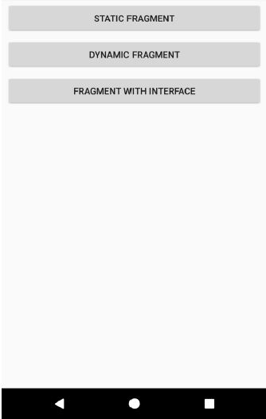
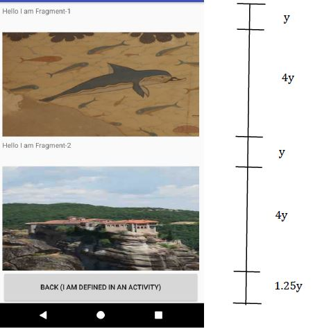
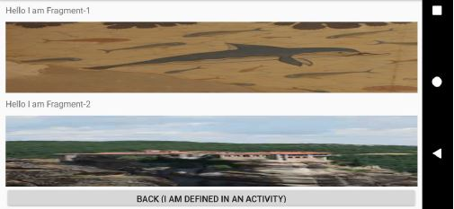
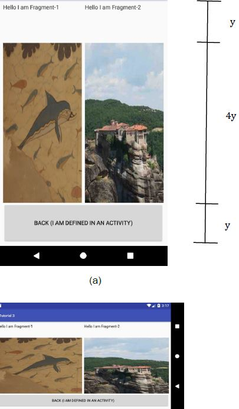
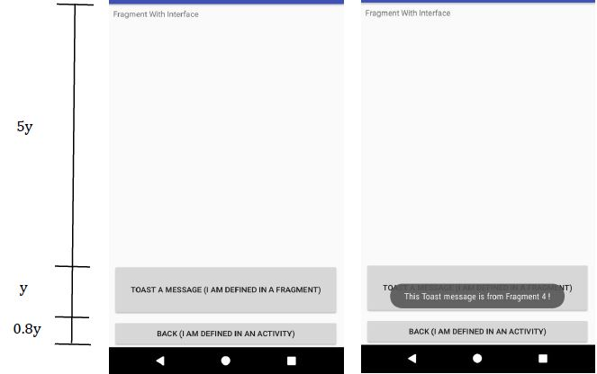

# FragmentsApp
This is the repository that contains both the starter and finished application which is written in Kotlin.

## Getting Started
1. Download the code.
2. Pick either the starter or finished directory and open the "Fragments" folder in Android Studio.
3. Run the app.

## Introduction
A mobile application that attaches fragments statically, dynamically, and communicate between a fragment and its host activity in Kotlin using Android Studio. The application will display images within the fragments.
The layout intended for the application is shown in the screenshots below. 

The MainActivity, which is the app’s launching activity, should show 3 buttons.
1. Static Fragment
2. Dynamic Fragment
3. Fragment with Interface

### Static Fragment
The “Static Fragment” button in MainActivity will bring the user to ActivityStatic. The portrait and landscape modes of ActivityStatic are as shown.

ActivityStatic: Two fragments and a button arranged in vertical order. Fragment-1 and Fragment-2 each contains a Text View and a picture. 

Fragment-1 and Fragment-2 are statically attached to ActivityStatic. Fragment-1 and Fragment-2 each contains a photograph. The photograph is stretched to fill the available space.

The “Back (I AM DEFINED IN AN ACTIVITY)” button is defined in ActivityStatic. Upon pressing this button, it will redirect back to the Main Activity page.

### Dynamic Fragment
The “Dynamic Fragment” button in MainActivity will bring the user to ActivityDynamic. The portrait and landscape modes of ActivityDynamic are as shown.

Fragment-1 and Fragment-2 are now dynamically attached to ActivityDynamic. Fragment-1 and Fragment-2 each contains a photograph. The photograph is stretched to fill the available space.

ActivityDynamic: Two fragments and a button arranged in horizontal order. Fragment-1 and Fragment-2 each contains a Text View and a picture. The “BACK (I AM DEFINED IN AN ACTIVITY)” button is defined in ActivityDynamic. Upon pressing this button, it will redirect back to the Main Activity page.

### Fragment with Interface
The “Fragment With Interface” button in MainActivity will bring the user to ActivityInterface. ActivityInterface is as shown. 

The fragment is statically attached to ActivityInterface. The fragment contains two view items: TextView and a button labelled as “(TOAST A MESSAGE: I AM DEFINED IN A FRAGMENT)”. When the button “(TOAST A MESSAGE: I AM DEFINED IN A FRAGMENT)” is pressed, a message “This Toast message is from Fragment 4!” will be toasted.

When the button “BACK (I AM DEFINED IN AN ACTIVITY) is pressed, it will redirect back to the Main Activity page.

